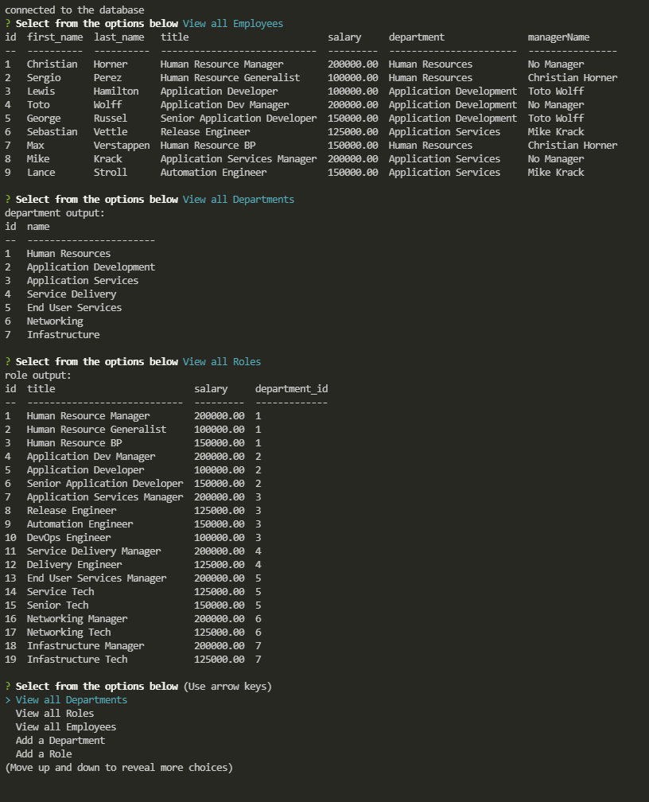

# Trusty Employee Tracker!
  
  

  ## Description

Trusty Employee Tracker will allow you to keep track of all of the departments, roles, and employees in the company! This includes their salaries and organzational structure. Included in this command line interface is options to update roles, add employees, roles, and departments. Lastly, you can choose to view all of your departments, roles, or employees with this application!

  ## Table of Contents
  * [Install](#install)
  * [Usage](#usage)
  * [License](#license)
  * [Contributing](#contributing)
  * [Testing](#testing)
  * [Questions](#questions)

## Install

To install all necessary dependencies, use the following command:

~~~
npm i
~~~

## Usage

To use the appplication, use the following command: 

~~~
npm start
~~~

## License

This project is under the MIT license!

## Contributing
To contribute please contact me at the email below.

## Testing

To test the application, use the following command:

~~~
no test included
~~~

## Questions

For any questions regarding the repo or application, please contact me at jacobllewis@outlook.com. I do have additional projects on display at https://github.com/JLewis1995/.

https://github.com/JLewis1995/TrustyEmployeeTracker

https://youtu.be/7v3kePcnwYs

